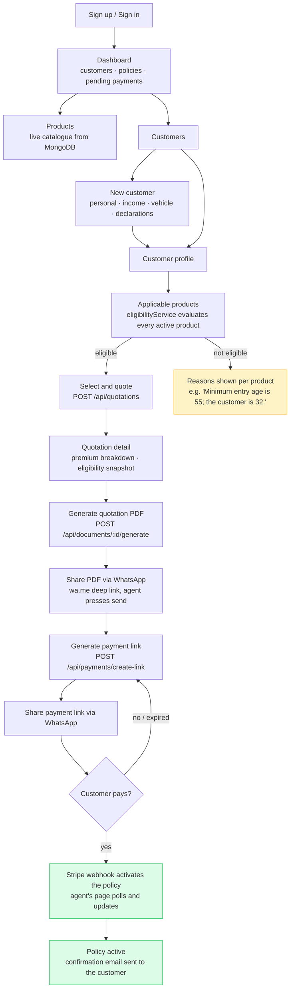

# Agent journey

Every step above is a screen in the dashboard. The quotation detail page renders
this sequence as a stepper so the agent can see where a customer has got to
without reading a status field.
