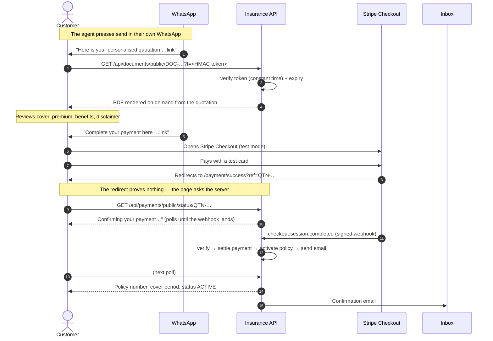

# Customer journey

The customer never signs in and never sees the dashboard. They interact with
exactly three things: a WhatsApp message, a PDF, and Stripe Checkout.

## Why the return page does not simply say "success"

Stripe's `success_url` is an ordinary browser redirect. A customer can reach it
by editing the address bar, and it can arrive before the webhook has been
processed. The page therefore reports the status the **server** holds, and polls
until the webhook has settled the payment. The frontend is never the authority
on whether money moved.
