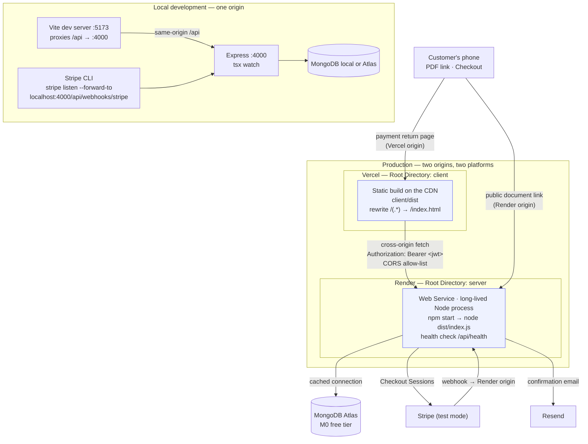
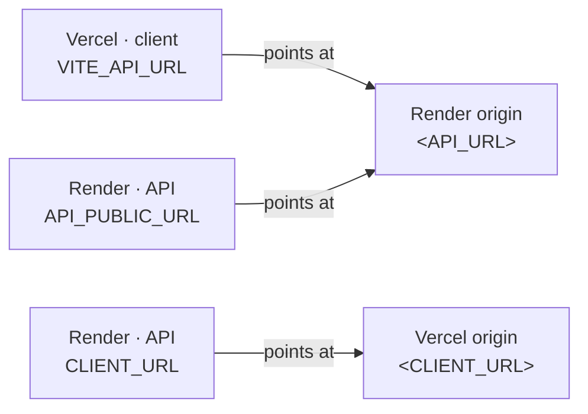

# Deployment architecture

The client and the API are **two independently deployable projects** from one
repository, on **two different platforms**.

## The three URLs that must agree

| Variable | Set on | Value | Symptom when wrong |
| --- | --- | --- | --- |
| `VITE_API_URL` | Vercel | `<API_URL>/api` | Requests go nowhere useful |
| `CLIENT_URL` | Render | `<CLIENT_URL>` | CORS blocks the browser; Stripe redirects wrongly |
| `API_PUBLIC_URL` | Render | `<API_URL>` | WhatsApp PDF links 404 |

`VITE_API_URL` is inlined by Vite **at build time** — changing it needs a client
redeploy, not just a dashboard edit.

## Why a long-lived process for the API

Render runs `node dist/index.js` and keeps it alive, rather than invoking a
function per request. For this service that removes several concerns:

- no serverless adapter to maintain, and no host that consumes the request
  stream before Express sees it — which matters because Stripe signature
  verification needs the exact raw bytes;
- no execution-time ceiling on PDF generation;
- one warm MongoDB connection pool instead of a cache keyed on `globalThis`
  (the caching is still there and still correct — it simply stops being
  load-bearing).

The cost is the free plan's idle spin-down: after ~15 minutes the service stops,
and the next request waits ~50 seconds. A Stripe webhook that arrives during a
spin-down times out and is **retried** — harmless here, because the handler is
idempotent by construction. See
[../../server/docs/payment-idempotency.md](../payment-idempotency.md).

## What splitting the deployment changed

| | Single origin | Two origins (current) |
| --- | --- | --- |
| Auth transport | httpOnly `SameSite=Lax` cookie | `Authorization: Bearer` from `localStorage` |
| XSS exposure of the session | None — JS cannot read the cookie | **Token is readable by JS** |
| CSRF | Mitigated by `SameSite=Lax` | Not applicable — Bearer is not sent automatically |
| CORS | Not needed | Load-bearing; strict allow-list |
| API URL in the client | Relative `/api` | Build-time `VITE_API_URL` |
| Deploys | One | Two, independent |

The server still issues and accepts the cookie, so putting both behind one
domain would restore the httpOnly path with no application change.

Full instructions: [../deployment.md](../deployment.md).
