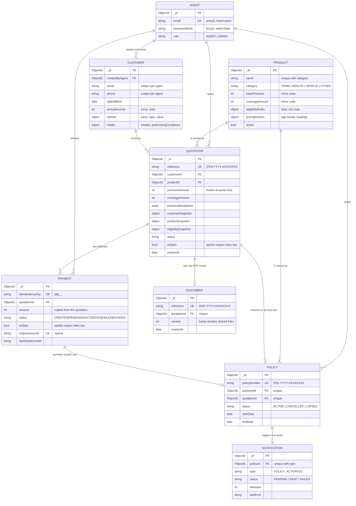

# Entity relationships

A ninth collection, `webhook_events`, has no relationships: it is a flat ledger
of processed Stripe event ids, keyed by a unique index on `eventId`.

Full field lists, index rationale and the snapshot-versus-reference reasoning
are in [../database-design.md](../database-design.md).
