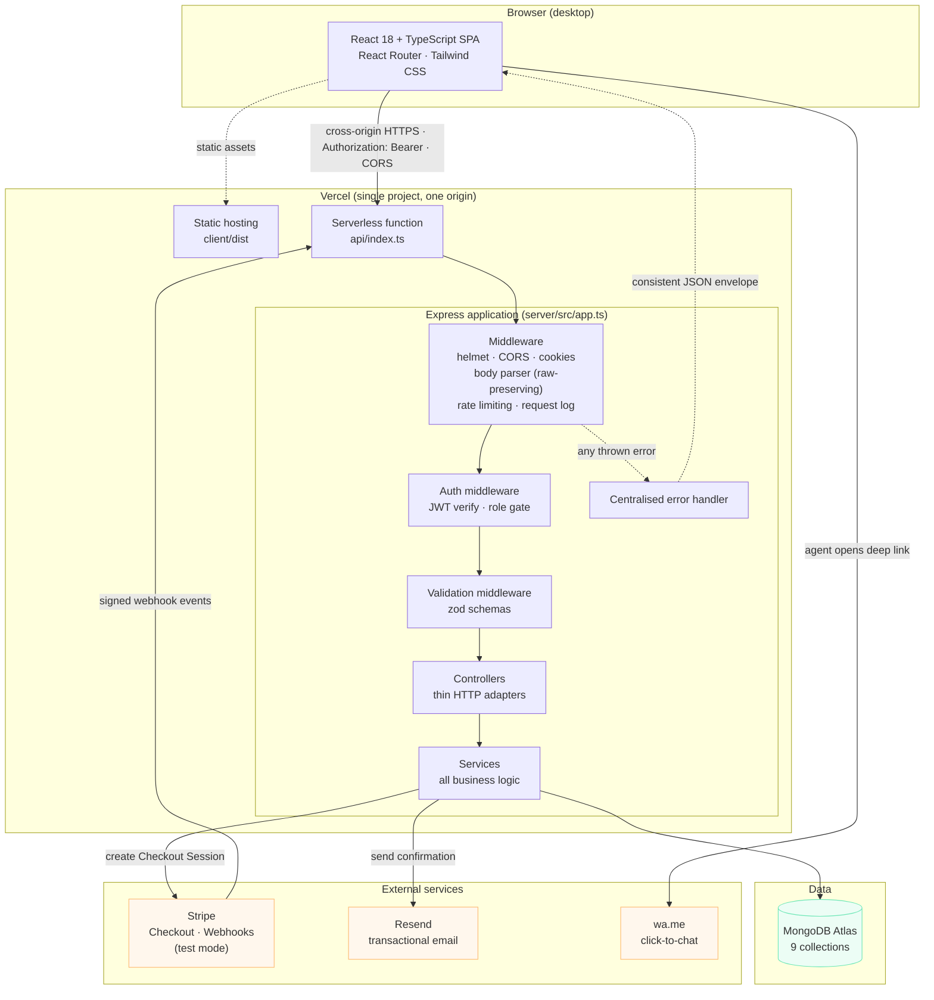

# High-level architecture

## Layer responsibilities

| Layer | Responsibility | Never does |
| --- | --- | --- |
| Controller | Read the request, call one service, shape the response | Business rules, database access |
| Service | All domain logic, orchestration, external calls | Know about `req`/`res` |
| Model | Schema, indexes, serialisation transform | Decide policy |
| Middleware | Cross-cutting: auth, validation, errors, limits | Domain logic |

The Express app is created by a factory (`createApp()`) that never calls
`listen`. The same object is used by the local server, the Vercel adapter and
the Supertest suite, so there is no separate "serverless" code path that could
drift from the one under test.

The SPA and the API are separate Vercel projects, so every browser request is
cross-origin: CORS is enforced against an allow-list, and the session travels as
a Bearer token rather than a cookie. See
[deployment-architecture.md](deployment-architecture.md).
