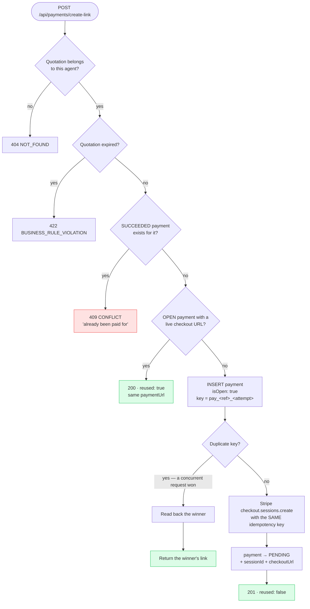
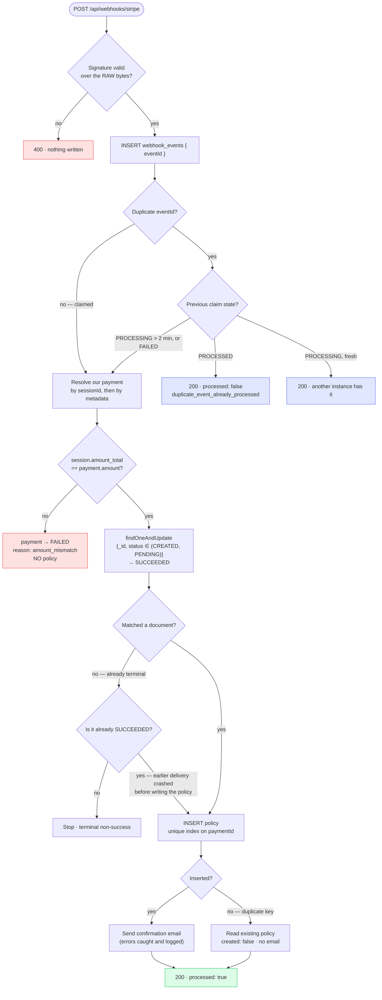

# Idempotency flow

## Creating a payment link

## Processing a webhook

The narrative version, with the failure modes each layer covers, is in
[../payment-idempotency.md](../payment-idempotency.md).
