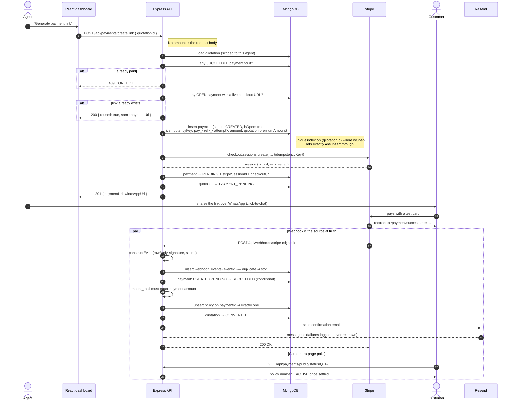

# Payment flow

## The three guarantees

1. **The amount is never supplied by a client.** `POST /api/payments/create-link`
   accepts one field, `quotationId`. The charge is read from the stored
   quotation, which was itself priced by `premiumService` from stored product
   and customer records.
2. **The frontend never marks a payment successful.** It has no endpoint that
   could. Only a signature-verified Stripe webhook can move a payment to
   `SUCCEEDED`.
3. **One logical payment produces one policy.** See
   [idempotency-flow.md](idempotency-flow.md).
